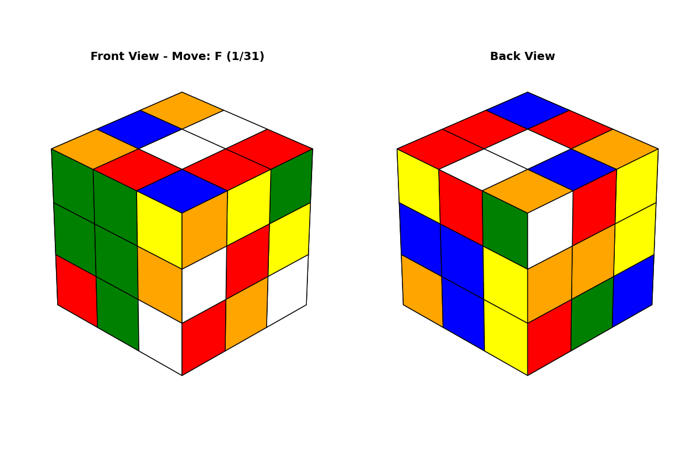

# RubicksRL

A learning-based approach to solving the Rubik's Cube. (Not really standard RL though)

## Project Goal

Successfully solve 1000 completely scrambled cubes (50 random moves) with:
- **100% success rate**
- **≤40 moves** per solution (shorter than scramble)
- **<60 seconds** per solution

This can be checked with the `project_completed.py` script and was achieved - **PROJECT COMPLETED**!

## How It Works

### Training (`train_resnet.py`)
- Generates training data from random cube trajectories (self-play)
- Trains a ResNet to estimate distance-to-solved for any cube state
- Uses iterative learning: generate data → train → use improved model to generate better data
- Leverages optimal-value datasets for bootstrapping accurate value estimates

### Solver (`solvers.py`)
The `SuperSolver` uses the neural network as a heuristic to guide the search to the solution:
- **Heuristic**: Neural network estimates moves needed to solve
- **Search**: A* inspired, explores move sequences, prioritizing states closest to solved
- **Weighted**: Emphasizes heuristic over path length for faster, greedier solutions
- **Batched inference**: Evaluates multiple states simultaneously on GPU for efficiency
- **Dataset integration**: Uses precomputed optimal values for close to solved states to improve efficiency
